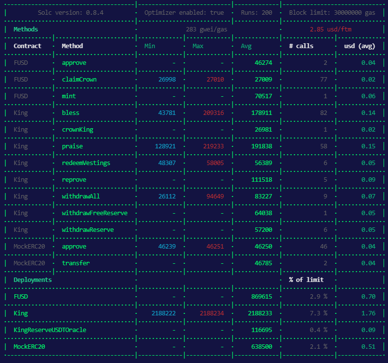

# Coverage

| File                         | % Stmts    | % Branch   | % Funcs    | % Lines    | Uncovered Lines  |
| ---------------------------- | ---------- | ---------- | ---------- | ---------- | ---------------- |
| contracts\                   | 98.51      | 86.36      | 94.12      | 98.59      |                  |
| King.sol                     | 98.41      | 85         | 92.31      | 98.48      | 277              |
| WUSD.sol                     | 100        | 100        | 100        | 100        |                  |
| contracts\Mocks\             | 100        | 100        | 100        | 100        |                  |
| KingReserveUSDTOracle.sol    | 100        | 100        | 100        | 100        |                  |
| MockERC20.sol                | 100        | 100        | 100        | 100        |                  |
| ---------------------------- | ---------- | ---------- | ---------- | ---------- | ---------------- |
| All files                    | 98.55      | 86.36      | 94.74      | 98.63      |                  |
| ---------------------------- | ---------- | ---------- | ---------- | ---------- | ---------------- |

> Istanbul reports written to ./coverage/ and ./coverage.json

# Gas costs

